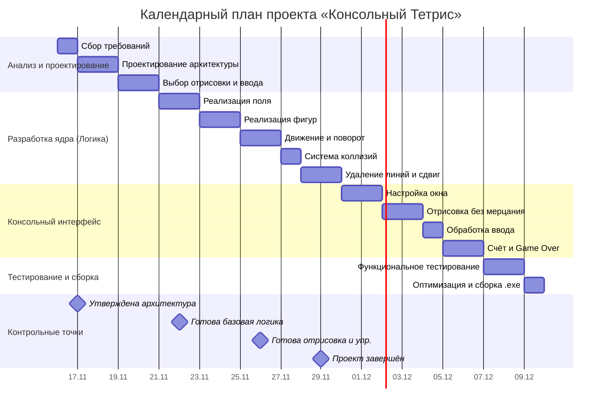

**# Практическая работа №2. Календарный план проекта**

```mermaid
gantt
    title Календарный план проекта «Консольный Тетрис»
    dateFormat YYYY-MM-DD
    axisFormat %d.%m

    section Анализ и проектирование
    Сбор требований            :t1, 2026-11-16, 1d
    Проектирование архитектуры :t2, after t1, 2d
    Выбор отрисовки и ввода    :t3, after t2, 2d

    section Разработка ядра (Логика)
    Реализация поля            :t4, after t3, 2d
    Реализация фигур           :t5, after t4, 2d
    Движение и поворот         :t6, after t5, 2d
    Система коллизий           :t7, after t6, 1d
    Удаление линий и сдвиг     :t8, after t7, 2d

    section Консольный интерфейс
    Настройка окна             :t9, after t8, 2d
    Отрисовка без мерцания     :t10, after t9, 2d
    Обработка ввода            :t11, after t10, 1d
    Счёт и Game Over           :t12, after t11, 2d

    section Тестирование и сборка
    Функциональное тестирование:t13, after t12, 2d
    Оптимизация и сборка .exe  :t14, after t13, 1d

    section Контрольные точки
    Утверждена архитектура     :milestone, m1, 2026-11-17, 0d
    Готова базовая логика      :milestone, m2, 2026-11-22, 0d
    Готова отрисовка и упр.    :milestone, m3, 2026-11-26, 0d
    Проект завершён            :milestone, m4, 2026-11-29, 0d
```
